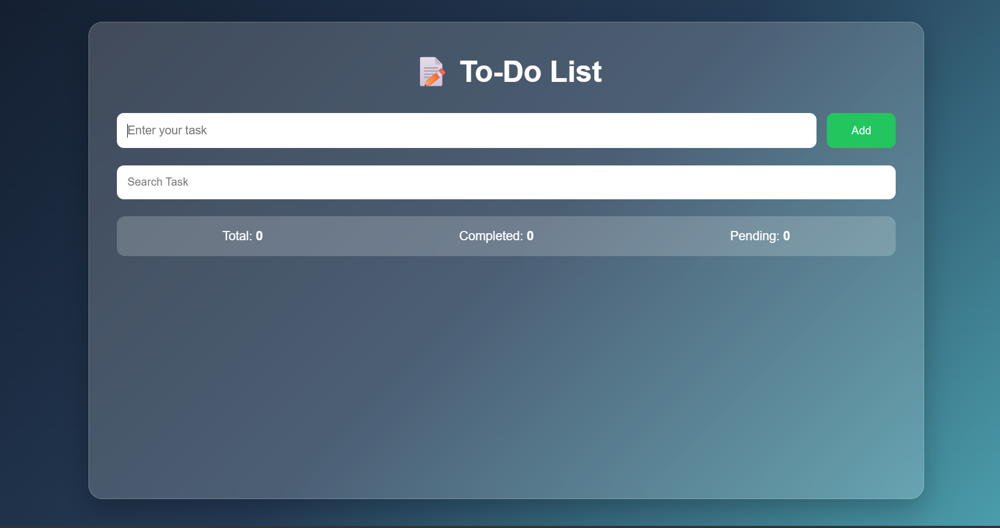
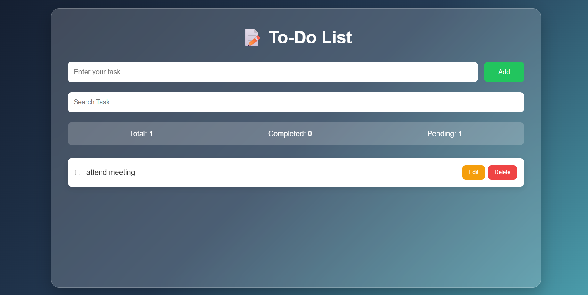
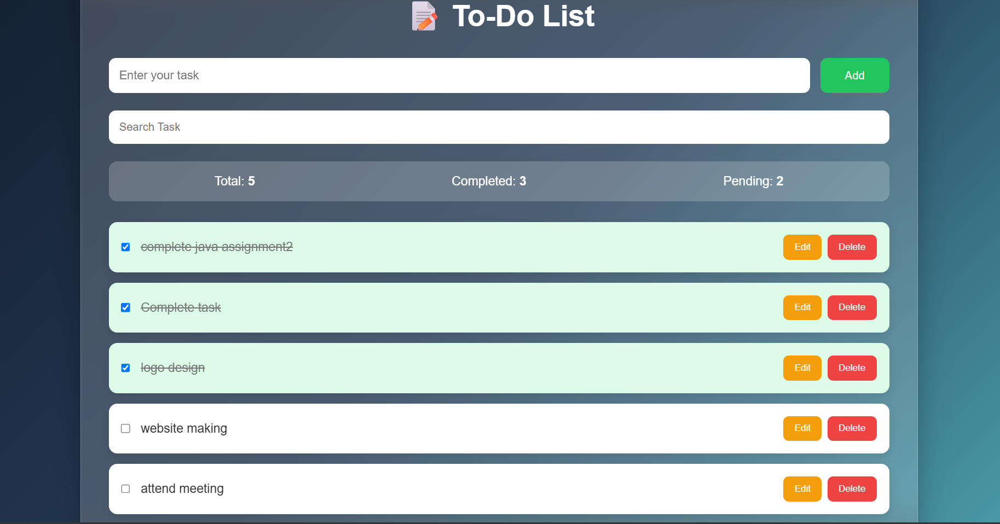
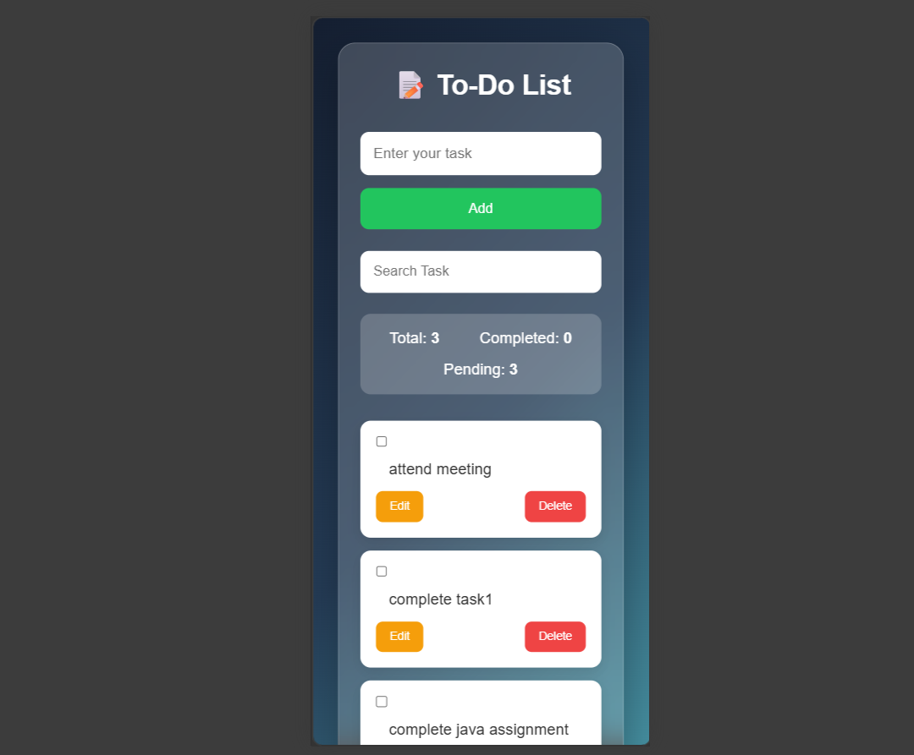

# 📝 Responsive To-Do Application

A modern, responsive To-Do application built using **HTML, CSS, and JavaScript**. This project helps users organize and manage their daily tasks efficiently. It supports adding, editing, deleting, searching, and marking tasks as completed, while storing all data in the browser using **Local Storage**.

---

## 📌 Features

- ✅ Add new tasks
- ✅ Display all tasks dynamically
- ✅ Mark tasks as completed
- ✅ Edit existing tasks using a custom popup modal
- ✅ Delete tasks
- ✅ Search tasks by name
- ✅ Task counter (Total, Completed, Pending)
- ✅ Data persistence using Local Storage
- ✅ Responsive design for Mobile, Tablet, and Desktop
- ✅ Clean and modern UI with gradient background and glassmorphism effect

---

## 🛠️ Technologies Used

- HTML5
- CSS3
- JavaScript (ES6)
- Browser Local Storage

---

## 📂 Project Structure

```
To-Do-App/
│── index.html
│── style.css
│── script.js
│── README.md
```

---

## 🚀 How to Run the Project

1. Clone the repository

```bash
git clone https://github.com/your-username/todo-app.git
```

2. Navigate to the project folder.

3. Open `index.html` in your browser.

No additional software or installation is required.

---

## 📖 How It Works

### Add Task
- Enter a task name.
- Click the **Add** button.
- The task is added to the task list and saved in Local Storage.

### Display Tasks
- All tasks are displayed dynamically using JavaScript DOM manipulation.

### Complete Task
- Click the checkbox to mark a task as completed.
- Completed tasks are displayed with:
  - Strike-through text
  - Green background

### Edit Task
- Click the **Edit** button.
- A custom popup modal appears.
- Update the task and click **Save**.

### Delete Task
- Click the **Delete** button to remove a task.

### Search Task
- Type in the search bar.
- Tasks are filtered instantly based on the entered text.

### Task Counter
The application automatically displays:
- Total Tasks
- Completed Tasks
- Pending Tasks

---

## 💾 Local Storage

The application uses **Local Storage** to save task data permanently.

Each task is stored as an object.

Example:

```javascript
{
    name: "Complete Java Assignment",
    completed: false
}
```

All task objects are stored inside an array.

```javascript
let tasks = [
    {
        name: "Complete Java Assignment",
        completed: false
    }
];
```

The array is converted into JSON format before saving.

```javascript
localStorage.setItem("tasks", JSON.stringify(tasks));
```

When the application starts, the saved data is retrieved using:

```javascript
tasks = JSON.parse(localStorage.getItem("tasks")) || [];
```

---

## 📱 Responsive Design

The application is fully responsive and works on:

- 📱 Mobile
- 📱 Tablet
- 💻 Laptop/Desktop

The layout automatically adjusts using CSS Flexbox and Media Queries.

---


## 📷 Screenshots
### Home Page



### Task Added



### Task Completed



###  Mobile View



### Tablet View


---

## 🎯 Future Improvements

- 🌙 Dark/Light Mode
- 📅 Due Date & Time
- 🔥 Task Priority
- 🏷️ Task Categories
- 🔔 Toast Notifications
- 🗑️ Delete Confirmation Popup
- 🎯 Drag & Drop Task Sorting

---

## 📚 Learning Outcomes

Through this project, I gained hands-on experience with:

- HTML page structure
- CSS Flexbox
- Responsive Web Design
- JavaScript DOM Manipulation
- Event Handling
- Arrays & Objects
- Local Storage
- CRUD Operations
- UI Design Principles

---

## 👩‍💻 Developed By

**Bhanu Priyanka**


⭐ If you found this project useful, consider giving it a star on GitHub!
